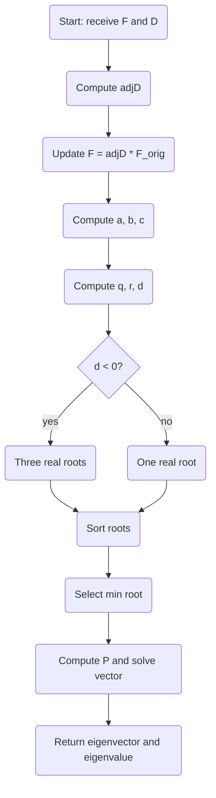

# Passive-Radar Tracking Prototype

## 1. Overview
We want a simple, interactive prototype to  
• ingest TDOA/FDOA measurements  
• run a first-cut localization  
• feed into a tracking filter (e.g. Kalman or Particle Filter)  
• visualize tracks in 2D/3D in real time

## 2. Recommended Stack
- Language: Python or MATLAB (Python + Jupyter for rapid prototyping)   -> yes
- Core libs (Python):  
  • numpy / scipy (linear algebra)  
  • filterpy or pykalman (filters)  
  • pandas (data handling)  
  • plotly or bokeh (interactive plots)  
- Optional:  
  • OpenCV or trackpy for multi‐object association  
  • ROS + rviz for real-time streaming  
  • MATLAB Fusion Toolbox if staying fully in MATLAB  

## 3. Pipeline Components
1. **Data Acquisition**  
   • read raw IF/IQ or precomputed TDOA/FDOA  
   • timestamp & tag by sensor pair  
2. **Preprocessing**  
   • denoise, sync clocks, outlier reject  
3. **Localization**  
   • call your `min_gen_eig_cmp` routine per time step  
   • produce a batch of position fixes  
4. **Measurement Association**  
   • gate new fixes to existing tracks (nearest‐neighbor, JPDA)  
5. **Tracking Filter**  
   • Kalman / Extended Kalman for each track  
   • update state estimates & covariances  
6. **Visualization**  
   • real-time 2D/3D scatter + track trails  
   • optional UI for selecting tracks  

## 4. Mermaid Workflow

```mermaid
flowchart TD
  DA[Data Acquisition] --> DP[Preprocessing]
  DP --> LO[Localization<br/>TDOA/FDOA algos]
  LO --> MA[Measurement<br/>Association]
  MA --> TF[Tracking Filter<br/>KF / PF]
  TF --> VZ[Visualization<br/>Plotly / rviz]
  VZ --> DA
 ```


# Client/server

## 5. Client/Server Architecture

We assume multiple Raspberry-Pi “edge” nodes acquire raw IF/IQ or precomputed TDOA/FDOA, perform light preprocessing locally, then forward features to a central server. The server assembles tracks, runs data-association and filters, and streams results back to clients or a dashboard. Nodes register via heartbeat and can join/leave at runtime.

```mermaid
flowchart LR
  %% Edge cluster
  subgraph Edge Nodes
    direction TB
    PI1[Raspberry Pi 1]
    PI2[Raspberry Pi 2]
    PI3[Raspberry Pi 3]
    PI4[Raspberry Pi 4]
  end

  %% Central server
  subgraph Central Server
    CS[“Tracker” API & DB]
    UI[Web Dashboard]
  end

  %% Data flow
  PI1 -->|TDOA/FDOA features| CS
  PI2 -->|TDOA/FDOA features| CS
  PI3 -->|TDOA/FDOA features| CS
  PI4 -->|TDOA/FDOA features| CS

  %% Control & health
  CS -->|config, firmware| PI1
  CS -->|config, firmware| PI2
  CS -->|config, firmware| PI3
  CS -->|config, firmware| PI4

  PI1 -. heartbeat .-> CS
  PI2 -. heartbeat .-> CS
  PI3 -. heartbeat .-> CS
  PI4 -. heartbeat .-> CS

  %% Visualization
  CS -->|real-time tracks| UI

  %% Resilience notes
  classDef offline stroke:#f66,stroke-dasharray: 5 5;
  PI3:::offline
  PI4:::offline
```

# Algo explanation



